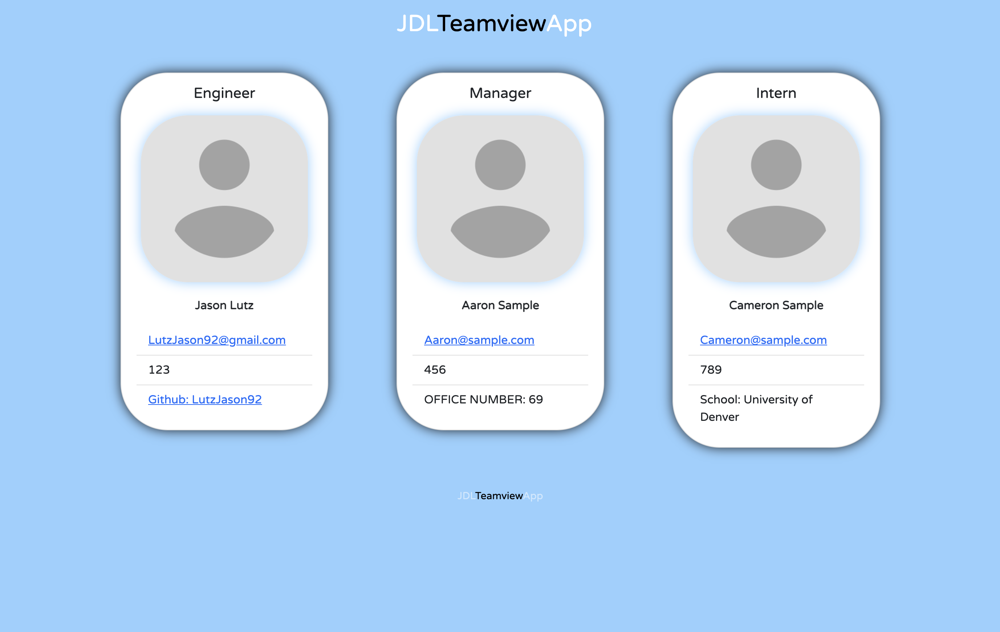

# Team Profile Generator: JDLTeamviewApp

?License=mit&logo=appveyor

## Table of Contents

- [Description](#description)
- [Technologies Used](#technologies-used)
- [Demonstration](#demonstration)
- [Setup](#setup)
- [Usage](#usage)
- [Project Updates](#project-updates)
- [Project Status](#project-status)
- [Have any Questions](#questions)
- [License](#license)

## Project Status

#### The status of Project Team Profile Generator: JDLTeamviewApp is currently:

- ##### _in progress_

#### Why is is the status of the Project _in progress_:

- ##### Still developing Tests

## Project Updates

Include Tests

## Demonstration

Live demo [_here_](https://drive.google.com/file/d/1F2H1Xjz4bwRU2GM9IqhXI-2qwvwntkiE/view?usp=sharing).

## Description

- a Node.js command-line application that takes in information about employees on a software engineering team, then generates an HTML webpage that displays summaries for each person.

## Technologies Used

- Node.js, inquirer, JS, HTML and CSS

## Setup

To use this application, you must have the following technologies installed:

- Node.js and Inquirer is required.

## Usage

- After installing node and inquirer, execute in the terminal "node index.js" to launch application and begin Prompts.

## Questions

This application was created by: [Jason Lutz](mailto:LutzJason92@gmail.com)

- I encourage you to send me an email if you have any questions or comments.

## Contributors

Thank you to these GitHub users for thier contributions:

- https://github.com/LutzJason92

## License

- This appplication is currently using a mit license.
